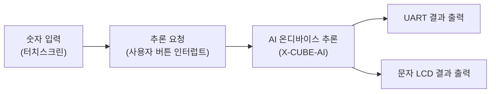
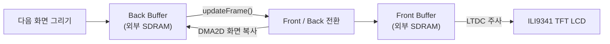
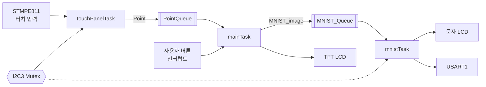

# STM32F429I-DISC1 MNIST Handwriting Recognition

STM32F429I-DISC1 보드에서 손글씨 숫자를 입력하고, 온디바이스 CNN으로 `0~9`를 분류하는 임베디드 AI 프로젝트입니다. 터치스크린에 숫자를 그린 뒤 보드의 파란색 사용자 버튼을 누르면 추론을 실행하고, 결과를 TFT LCD·문자 LCD·UART로 출력합니다.


## 주요 기능

- STMPE811 터치 컨트롤러를 이용한 손글씨 입력
- ILI9341 TFT LCD의 프레임 버퍼 기반 실시간 화면 출력
- X-CUBE-AI로 변환한 MNIST CNN의 STM32F429 추론
- FreeRTOS/CMSIS-RTOS2 기반 태스크 및 메시지 큐 구성
- 추론 결과를 TFT LCD, I2C 문자 LCD, USART1에 동시 출력
- PyTorch 모델 학습 및 ONNX 변환 코드 포함

## 동작 방법



사용자가 터치스크린에 숫자를 그린 뒤 파란색 사용자 버튼을 누르면 입력 이미지가 추론 태스크로 전달됩니다. STM32F429에서 CNN 추론을 수행한 후 분류 결과를 UART와 문자 LCD로 출력합니다.

## TFT 화면 더블 버퍼링



LTDC가 Front Buffer를 화면에 출력하는 동안 애플리케이션은 Back Buffer에 다음 프레임을 그립니다. 한 프레임의 렌더링이 끝나면 두 버퍼를 전환하고, DMA2D로 새 Front Buffer를 Back Buffer에 복사해 다음 부분 갱신의 기준 화면으로 사용합니다. 이를 통해 화면을 그리는 과정이 직접 노출되는 현상을 줄입니다.

## FreeRTOS 구조

펌웨어는 입력, 화면 갱신, AI 추론을 세 개의 태스크로 분리합니다. 태스크 사이의 데이터는 메시지 큐로 전달하며, 터치 컨트롤러와 문자 LCD가 공유하는 I2C3 버스는 뮤텍스로 보호합니다.



- `PointQueue`: 터치 좌표 `Point`를 `touchPanelTask`에서 `mainTask`로 전달합니다.
- `MNIST_Queue`: 완성된 `28 × 28` 입력 이미지 `MNIST_image`를 `mainTask`에서 `mnistTask`로 전달합니다.
- `I2C3_mutex`: STMPE811 터치 컨트롤러와 문자 LCD의 동시 I2C 접근을 방지합니다.
- 모든 태스크와 큐는 정적 메모리를 사용하도록 구성되어 런타임 동적 할당 의존성을 줄였습니다.

## FreeRTOS 태스크 소개

| 태스크 | 우선순위 | 역할 |
| --- | --- | --- |
| `mainTask` | Normal | 터치 좌표를 `28 × 28` 이미지로 변환하고 TFT 화면을 갱신합니다. 사용자 버튼이 눌리면 이미지를 추론 큐에 넣고 입력 화면을 초기화합니다. |
| `touchPanelTask` | Low | STMPE811의 터치 상태와 좌표를 읽고 LCD 좌표계로 변환한 뒤 `PointQueue`로 전달합니다. |
| `mnistTask` | Low | `MNIST_Queue`를 대기하다가 이미지를 받으면 X-CUBE-AI 모델로 추론하고 결과를 문자 LCD와 USART1에 출력합니다. |

### `mainTask`

- 외부 SDRAM과 ILI9341의 Front/Back Frame Buffer를 초기화합니다.
- `PointQueue`를 non-blocking 방식으로 확인해 터치 좌표 주변의 `3 × 3` 픽셀에 농도를 누적합니다.
- 약 16 ms 주기로 입력 이미지와 최근 추론 결과를 TFT에 렌더링합니다.
- 사용자 버튼 인터럽트가 설정한 플래그를 확인해 이미지를 `MNIST_Queue`로 전달합니다.

### `touchPanelTask`

- I2C3 뮤텍스를 획득한 상태에서 STMPE811의 터치 여부와 좌표를 읽습니다.
- 터치 패널의 좌표를 TFT LCD 해상도와 방향에 맞게 변환합니다.
- 변환한 좌표를 `PointQueue`에 넣고 약 16 ms 동안 대기합니다.

### `mnistTask`

- X-CUBE-AI 네트워크와 외부 SDRAM의 activation 버퍼를 초기화합니다.
- `MNIST_Queue`에서 입력 이미지가 도착할 때까지 blocking 상태로 대기합니다.
- `float32` 이미지로 CNN 추론을 수행하고 가장 높은 출력값의 인덱스를 결과 숫자로 선택합니다.
- 결과를 USART1과 I2C 문자 LCD로 출력하고 TFT 표시용 결과값을 갱신합니다.

## 하드웨어 및 기술 스택

- **보드:** STM32F429I-DISC1 (Cortex-M4F)
- **디스플레이:** 온보드 ILI9341 TFT LCD
- **터치 컨트롤러:** STMPE811
- **외부 메모리:** IS42S16400J SDRAM
- **추가 출력:** I2C 문자 LCD, USART1
- **펌웨어:** C11, C++20, STM32 HAL, FreeRTOS, CMSIS-RTOS2
- **AI:** PyTorch, ONNX, STM32Cube.AI/X-CUBE-AI
- **빌드:** CMake 3.22+, Ninja, GNU Arm Embedded Toolchain

생성된 float 모델은 입력 `1 × 28 × 28 × 1`, 출력 `1 × 10` 형식이며, X-CUBE-AI 리포트 기준 1,441개 파라미터, 324,461 MACC, 약 5.50 KiB의 가중치와 27.60 KiB의 activation 메모리를 사용합니다.

## 빌드

### 사전 준비

다음 도구가 `PATH`에 등록되어 있어야 합니다.

- CMake 3.22 이상
- Ninja
- GNU Arm Embedded Toolchain (`arm-none-eabi-gcc`, `arm-none-eabi-g++`)
- 펌웨어 기록용 STM32CubeProgrammer 또는 호환 디버거 도구

서브모듈을 포함해 저장소를 준비합니다.

```bash
git clone --recurse-submodules <repository-url>
cd LIGNex1_miniProject
```

이미 clone한 경우 다음 명령으로 서브모듈을 가져옵니다.

```bash
git submodule update --init --recursive
```

### Debug 빌드

```bash
cmake --preset Debug
cmake --build --preset Debug
```

### Release 빌드

```bash
cmake --preset Release
cmake --build --preset Release
```

결과 ELF 파일은 각각 아래에 생성됩니다.

```text
build/Debug/F429I_DISC1_miniProject.elf
build/Release/F429I_DISC1_miniProject.elf
```

생성된 ELF를 ST-LINK와 STM32CubeProgrammer, OpenOCD 또는 사용 중인 IDE의 디버거 설정으로 보드에 기록합니다.

## 모델 학습 및 변환

모델 관련 코드는 `models/MNIST`에 있으며 Python 3.9 이상을 권장합니다.

```bash
cd models/MNIST
pip install torch torchvision tqdm matplotlib onnx
python train.py --BatchSize 512 --epochs 10 --learningRate 0.001 --savePath ./models/MNIST.pth
python convertONNX.py --modelPath ./models/MNIST.pth --onnxPath ./models/model.onnx --batchSize 1 --opset 17
```

생성된 `model.onnx`는 STM32CubeMX의 X-CUBE-AI를 통해 C 코드로 변환합니다. 현재 펌웨어가 사용하는 생성물은 `X-CUBE-AI/App`에 있으며, 모델을 다시 변환했다면 해당 파일들과 X-CUBE-AI 런타임 설정의 호환성을 확인한 뒤 펌웨어를 다시 빌드해야 합니다.

> 참고: 모델 정의에서 dropout 계층은 `prob != 0`일 때 생성되므로 학습 및 ONNX 변환 시 동일한 `dropoutProb` 설정을 사용해야 합니다.

## 프로젝트 구조

```text
.
├── App/
│   ├── Tasks/              # 화면, 터치, MNIST 추론 태스크
│   ├── Interrupts/         # 애플리케이션 인터럽트 처리
│   └── Common/             # 공용 타입, 이미지, 뮤텍스 유틸리티
├── Core/                   # CubeMX 생성 코드 및 FreeRTOS 구성
├── Drivers/                # HAL, CMSIS 및 장치 드라이버
├── Middlewares/
│   ├── MNIST_model/        # X-CUBE-AI 모델 래퍼
│   ├── ST/AI/              # STM32 AI 런타임
│   └── Third_Party/        # FreeRTOS
├── X-CUBE-AI/App/          # 변환된 CNN 소스와 생성 리포트
├── models/MNIST/           # PyTorch 학습 및 ONNX 변환 프로젝트
├── cmake/                  # CubeMX 및 Arm GCC 빌드 설정
├── F429I_DISC1_miniProject.ioc
├── CMakeLists.txt
└── CMakePresets.json
```

## 구현 참고사항

- TFT 프레임 버퍼는 외부 SDRAM의 `0xD0000000`부터 사용합니다.
- X-CUBE-AI activation 버퍼는 외부 SDRAM의 `0xD0050000`에 배치됩니다.
- 입력은 각 터치 지점을 중심으로 `3 × 3` 픽셀에 농도를 누적해 손글씨 획을 구성합니다.
- 모델 입력은 정규화된 `float32` 값 784개이며 별도의 이미지 전처리 태스크는 없습니다.
- `.ioc`를 다시 생성할 때 `Core` 및 CMake 설정의 사용자 코드가 유지되는지 확인하세요.

## 데모 영상

[YouTube Shorts에서 동작 영상 보기](https://www.youtube.com/shorts/CuLU76D0u6U)

## 라이선스

STM32Cube.AI 관련 구성 요소는 [LICENSE_X-CUBE-AI.txt](LICENSE_X-CUBE-AI.txt)와 `Middlewares/ST/AI/LICENSE.txt`를 따릅니다. HAL, CMSIS, FreeRTOS 및 각 서브모듈에는 별도의 라이선스가 적용될 수 있으므로 배포 전에 각 라이선스 파일을 확인하세요.
